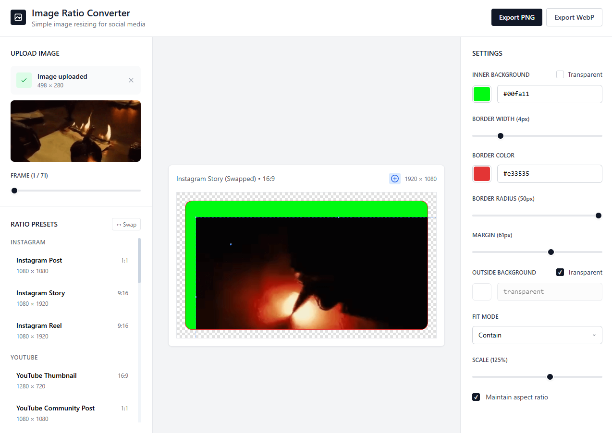

# Image Ratio Converter

A simple yet powerful tool to resize images for various social media platforms, providing extensive customization options.



## ✨ Features

- **🖼️ Image Upload:** Supports various image formats, including GIF, with an easy-to-use drag-and-drop interface.
- **🎞️ GIF Support:** Upload and preview individual frames of animated GIFs.
- **📏 Social Media Presets:** A comprehensive list of presets for platforms like Instagram, YouTube, Facebook, TikTok, and more.
- **🛍️ Chrome Web Store Presets:** Ready-made sizes for icons, screenshots, and promo tiles.
- **🔄 Ratio Swap:** Easily swap aspect ratios (e.g., 16:9 to 9:16) with a single click.
- **🎨 Customization:**
  - **Backgrounds:** Set custom colors for inner and outer backgrounds, with transparency options.
  - **Borders:** Adjust border width, color, and radius.
  - **Margins:** Add margins around the image.
  - **Image Fit:** Control how the image fits within the frame with `Contain`, `Cover`, and `Fill` modes.
- **🔍 Advanced Editing:**
  - **Transformations:** Enter edit mode to freely move and scale the image.
  - **Aspect Ratio Lock:** Maintain the original aspect ratio while resizing.
- **🚀 Export Options:** Export the final image in high-quality PNG or WebP formats.
- **📱 Responsive Design:** A clean, modern, and responsive interface built with Tailwind CSS.

## 🛠️ Tech Stack

- **Frontend:** React.js
- **Styling:** Tailwind CSS
- **GIF Parsing:** [omggif](https://github.com/deanm/omggif)

## 🚀 Getting Started

To run this project locally, follow these steps:

1.  **Clone the repository:**
 ```bash
 git clone https://github.com/jonasfroeller/image-ratio-changer.git
 cd image-ratio-changer
 ```

2.  **Install dependencies:**
 ```bash
 yarn install
 ```
 (or `ni`)

3.  **Run the development server:**
 ```bash
 yarn run dev
 ```
 (or `nr dev`)

The application should now be running on `http://localhost:3000`.
